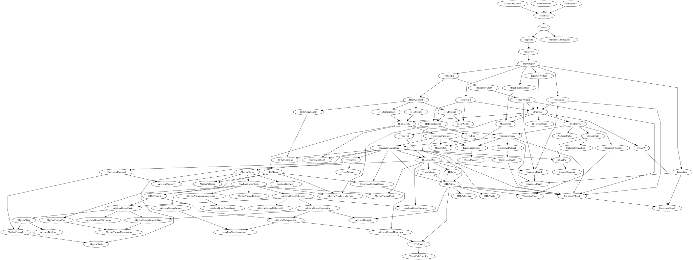

# Ground Zero

This is an attempt to develop Homotopy Type Theory in [Lean 4](https://github.com/leanprover/lean4/).

As in [gebner/hott3](https://github.com/gebner/hott3), no modifications to the Lean kernel are made, because library uses [large eliminator checker](https://github.com/rzrn/ground_zero/blob/master/GroundZero/Meta/HottTheory.lean) ported [from Lean 3](https://github.com/gebner/hott3/blob/master/src/hott/init/meta/support.lean). So stuff like this will print an error:

```lean
hott example {α : Type u} {a b : α} (p q : a = b) : p = q :=
begin cases p; cases q; apply Id.refl end
```

## Documentation

* [AIPROVER.md](AIPROVER.md) — a practical guide for automated theorem provers
  and AI-assisted proof engineers writing proofs against this library.  It
  collects the hott parser gotchas, the semantics of `hott definition` /
  `hott axiom` / `hott opaque axiom`, the name-resolution traps (e.g. core
  `Quotient` vs. the hott one), the quotient-HIT recipe, and the verification
  workflow — every item is grounded in real errors hit while developing proofs
  on top of this library.  It is a living document: new lessons are added there
  as they are discovered.  It also carries a series axiom reduction chart
  (Section 10): which real-analysis axioms the Gaussian-kernel PSD proof
  (`gaussPsd` in `PosDef.lean`) really needs, and which were reduced to
  theorems across evaluation rounds 追記評価1–6.
* [THEOREM_TIERS.md](THEOREM_TIERS.md) — a tiered catalog of the library's
  theorems for automated theorem provers.  Tier 1 lists the foundational core
  to try first (identity, transport, equivalences, funext, univalence,
  h-levels, ℕ), Tier 2 the standard derived lemmas, Tier 3 the HIT- and
  type-construction theorems, Tier 4 the domain-specific applications — plus
  an at-a-glance table of every axiom in the library.
* [GroundZero/Exercises](GroundZero/Exercises/README.md) — solutions to
  selected exercises of the [HoTT book](https://homotopytypetheory.org/book/),
  chapter by chapter (`Chap1.lean`–`Chap6.lean`).  Useful both as worked
  examples of the idioms described in `AIPROVER.md` and as practice material
  for proving things against the library.
* [Dependency map](#dependency-map) — how the modules of the library depend on
  each other.

## Maintenance

The documents that name library declarations — `AIPROVER.md`, `THEOREM_TIERS.md`,
and `GroundZero/Exercises/README.md` — are expected to stay in sync with the
live code.  The convention is enforced by a lightweight audit script that
builds a declaration inventory from every `.lean` file (namespace / section /
`begin..end` aware, covering all `hott` declaration keywords, structure and
class fields, inductive constructors, and `elab`'d tactics) and reports every
backticked name in the docs that no longer resolves:

```sh
python3 scripts/aiprover_audit.py                  # audits AIPROVER.md
python3 scripts/aiprover_audit.py THEOREM_TIERS.md # audits THEOREM_TIERS.md
python3 scripts/aiprover_audit.py GroundZero/Exercises/README.md
make audit                                         # all three
```

Run it after renaming or removing a declaration, or after adding new names to
the docs.  A non-empty report is expected to be triaged, not treated as a
failure: the remaining entries fall into known benign categories — notation
symbols (`⬝`/`⁻¹`), core Lean names (`unfold`, `Eq`), module names (`Proto`,
`Types`, `Structures`, `KernelLearn`, `RBF`), and intentional historical
mentions of retired or renamed declarations (e.g. `gaussPsd`/`infSumLin` in
the reduction chart, `lwhsΩ`/`rwhsΩ` in the reconciliation note).  As of
2026-08-12 the docs report zero *stale* names.

`AIPROVER.md` and `THEOREM_TIERS.md` are living documents: new lessons and new
theorem families are added there as they are discovered, and the audit is the
check that keeps their names honest.  See also [THEOREM_TIERS.md's Appendix B —
Maintenance convention](THEOREM_TIERS.md#appendix-b--maintenance-convention) for
the tier-classification conventions the audit protects.

## HITs

[Most HITs in the library](https://github.com/rzrn/lean/tree/master/ground_zero/HITs) constructed using [quotients](https://leanprover.github.io/theorem_proving_in_lean/axioms_and_computation.html#quotients). Quotients in Lean have good computational properties (`Quot.ind` computes), so we can define HITs with them without any other changes in Lean’s kernel.

There are:

* [Interval](https://github.com/rzrn/ground_zero/blob/master/GroundZero/HITs/Interval.lean) $I$.
* [Pushout](https://github.com/rzrn/ground_zero/blob/master/GroundZero/HITs/Pushout.lean) $\alpha \sqcup^\sigma \beta $.
* [Homotopical reals](https://github.com/rzrn/ground_zero/blob/master/GroundZero/HITs/Reals.lean) $R$.
* (Sequential) [colimit](https://github.com/rzrn/ground_zero/blob/master/GroundZero/HITs/Colimit.lean).
* [Generalized circle](https://github.com/rzrn/ground_zero/blob/master/GroundZero/HITs/Generalized.lean) $\{\alpha\}$.
* [Propositional truncation](https://github.com/rzrn/ground_zero/blob/master/GroundZero/HITs/Merely.lean) as a colimit of a following sequence:
  $` \alpha \rightarrow \{\alpha\} \rightarrow \{\{\alpha\}\} \rightarrow \ldots `$
* [Suspension](https://github.com/rzrn/ground_zero/blob/master/GroundZero/HITs/Suspension.lean) $\Sigma \alpha$ is defined as the pushout of the span $\mathbf{1} \leftarrow \alpha \rightarrow \mathbf{1}$.
* [Circle](https://github.com/rzrn/ground_zero/blob/master/GroundZero/HITs/Circle.lean) $S^1$ is the suspension of the bool $\mathbf{2}$.
* Sphere $S^2$ is the suspension of the circle $S^1$.
* [Join](https://github.com/rzrn/ground_zero/blob/master/GroundZero/HITs/Join.lean) $\alpha \ast \beta$.

There are also HITs that cannot be constructed this way. These HITs are defined using standard trick with [private structures](https://github.com/rzrn/ground_zero/blob/master/GroundZero/HITs/Trunc.lean).

## Dependency map



## Related works

* [sinhp/HoTTLean](https://github.com/sinhp/HoTTLean) is a Lean formalization of the groupoid model of homotopy type theory together with a proof mode for developing mathematics synthetically in those type theories.
* [jthulhu/2ltt](https://github.com/jthulhu/2ltt) is a formalization of [2LTT](https://ncatlab.org/nlab/show/two-level+type+theory) in Lean 4.
* [gebner/hott3](https://github.com/gebner/hott3) is a port of the Lean 2 HoTT library to Lean 3.
* [leanprover/lean2/hott](https://github.com/leanprover/lean2/blob/master/hott/hott.md) is an old Lean 2 HoTT library.
* [cmu-phil/Spectral](https://github.com/cmu-phil/Spectral) is a formalization of the Serre spectral sequence in Lean 2.
* [annenkov/two-level](https://github.com/annenkov/two-level) is a Lean 2 formalization of 2LTT.
* [bbentzen/hott-book-in-lean](https://github.com/bbentzen/hott-book-in-lean) is a formalization of the Part I of the HoTT book in Lean 2.

## License

Copyright © 2018–2026 rzrn &lt;rzrngh@outlook.com&gt;

Licensed under the Apache License, Version 2.0 (the “License”);
you may not use this project except in compliance with the License.
You may obtain a copy of the License at

http://www.apache.org/licenses/LICENSE-2.0

Unless required by applicable law or agreed to in writing, software
distributed under the License is distributed on an “AS IS” BASIS,
WITHOUT WARRANTIES OR CONDITIONS OF ANY KIND, either express or implied.
See the License for the specific language governing permissions and
limitations under the License.
